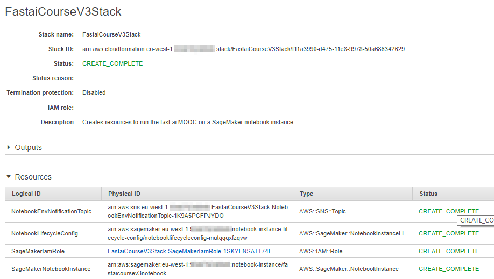
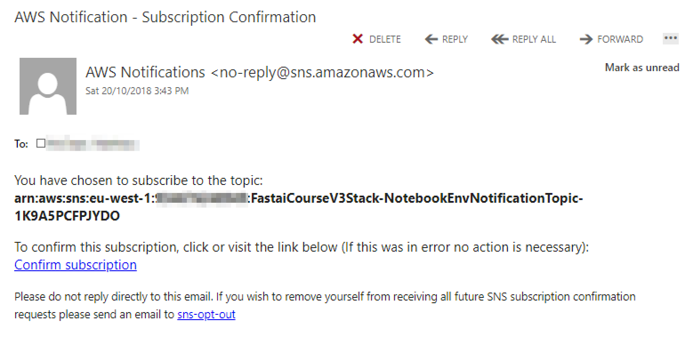
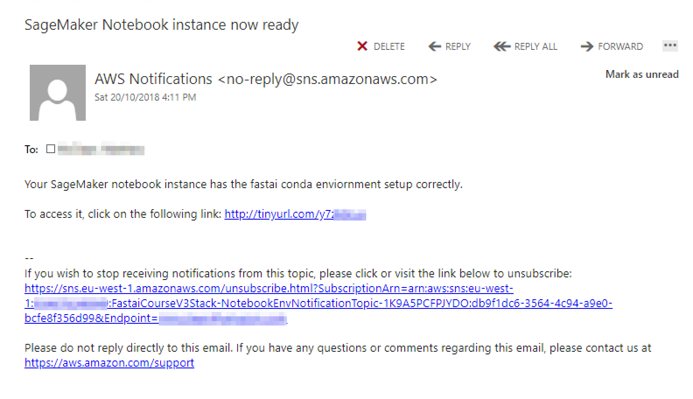
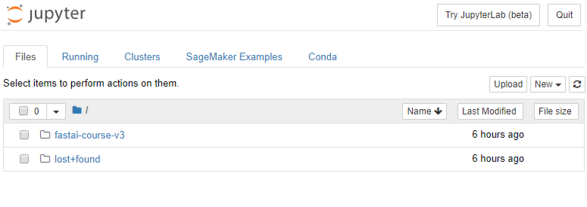

# SageMaker fast.ai notebook
Example project showing how to create a SageMaker notebook instance with the fast.ai library and course notebooks installed.

The notebook is designed to work with either [v 0.7](https://github.com/fastai/fastai/tree/v0.7.2) or [v 1.0](https://github.com/fastai/fastai/) of the fastai library. [v 0.7](https://github.com/fastai/fastai/tree/v0.7.2) should be used if you are taking [2nd edition of Practical Deep Learning For Coders](http://course.fast.ai) released online in early 2018. [v 1.0](https://github.com/fastai/fastai/) should be selected if you are taking the [3rd edition of Practical Deep Learning For Coders](https://www.usfca.edu/data-institute/certificates/deep-learning-part-one) that will be released online to the general public early 2019.

## Setup

Follow the instructions below to setup your IAM role, SageMaker Notebook Lifecycle Configuration, SNS Topic and SageMaker Notebook Instance.

We will use [CloudFormation](https://aws.amazon.com/cloudformation/) to create our resources via a template file. To do this,

1. Click the **Launch Template** button in the table below selecting the  region closest to you. It will  open the AWS CloudFormation Web Console a create a new CloudFormation stack. There are a few parameters you will need to fill in including the instance type, fastai library version and email address. The default instance type is **ml.p3.2xlarge** as this is required to train the fast.ai models quickly. The **ml.t2.medium** option is part of the AWS Free Tier. See the SageMaker [pricing page](https://aws.amazon.com/sagemaker/pricing/) for more details. Valid options are for the fast.ai library are **0.7** and **1.0**. The default option is **1.0**. You will need to enter your email address to receive a notification when the fastai environment has been installed correctly. Click through the options and select the SageMaker instance type, the fastai library version and your email address.

Region | Name | Launch link
--- | --- | ---
**US West (Oregon) Region** | **us-west-2** | 
  **US East (N. Virginia) Region** | **us-east-1** | 
**US East (Ohio) Region** | **us-east-2** | 
**Asia Pacific (Tokyo) Region** | **ap-northeast-1** | 
**Asia Pacific (Seoul) Region** | **ap-northeast-2** | 
**Asia Pacific (Sydney) Region** | **ap-southeast-2** | 
  **EU (Ireland) Region** | **eu-west-1** | 
**EU (Frankfurt) Region** | **eu-central-1** | 

Take note of the resources created including:
 - **IAM service role** allowing SageMaker access various AWS services
 - **SageMaker Notebook Lifecycle Config** scripts that are run when the SageMaker Notebook is created and started.
 - **SageMaker Notebook Instance** to run the fast.ai MOOC course notebooks.
 - **SNS Topic** to receive an email notification when the notebook is setup correctly with the fastai library and dependencies.

2. You will need to confirm the subscription to the SNS topic by checking the inbox of the email address supplied. Click the **Confirm subscription** link in the email to receive the notification email later.

3. Wait for up to 15 minutes to have all of the fastai libraries installed on the SageMaker notebook instance. When it has done you will receive an email with a link to the notebook instance as per the screenshot below. 

4. Click on the tinyurl.com based shortened link to open the Jupyter notebook web console.

